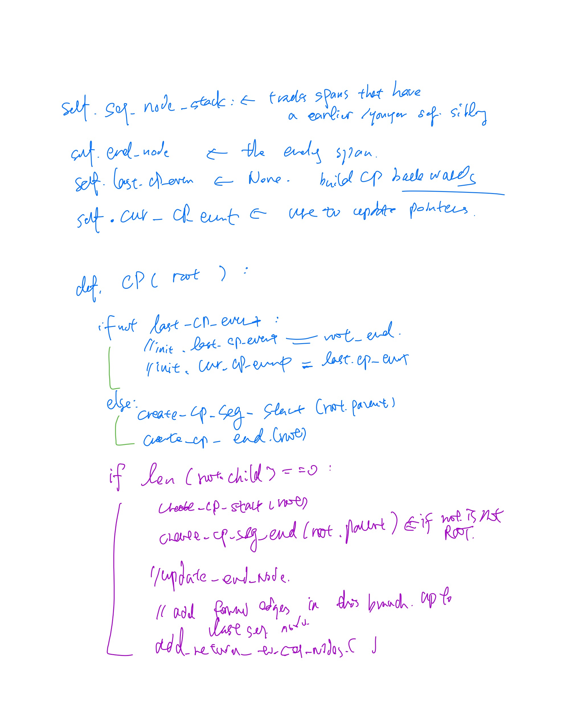
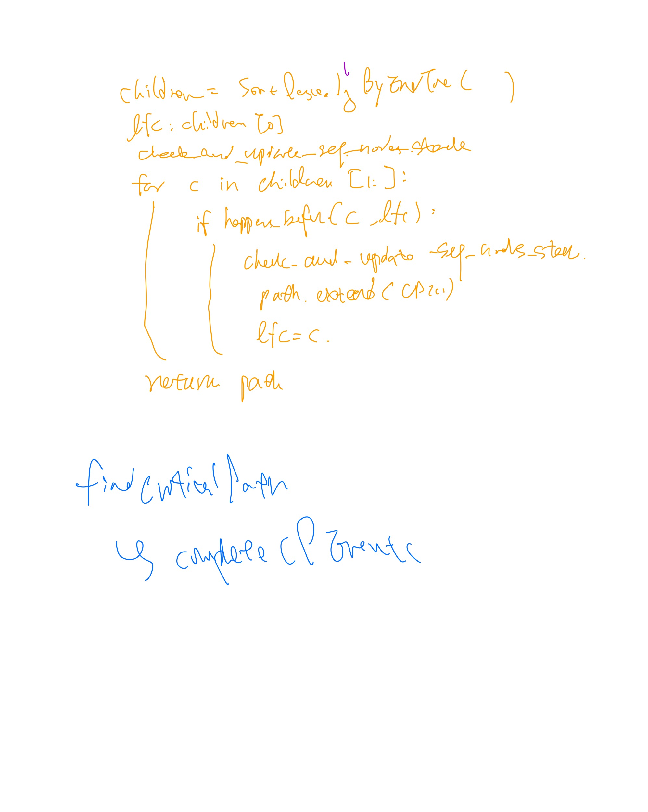

Critical Path Converter
============
Given span-based traces, this script extracts critical path events. This script processes input data from a specified directory and generates output files in the desired format. Follow the instructions below to run the script.


Algorithm, based on CRISP
============





Running the script
============

```bash
python3 cp_converter.py input_dir_path output_dir_path format
```
For output format, the script currently supports "txt", "dot", and "both". 


Input file format
============
The [traces](traces) directory shows the expected input file format and contains all test traces.
We explain the tests [brielfy and visually](traces/README.md).


Output files
============
Output files are currently either txt or dot. Critical path can be easily visualized using Graphviz.
